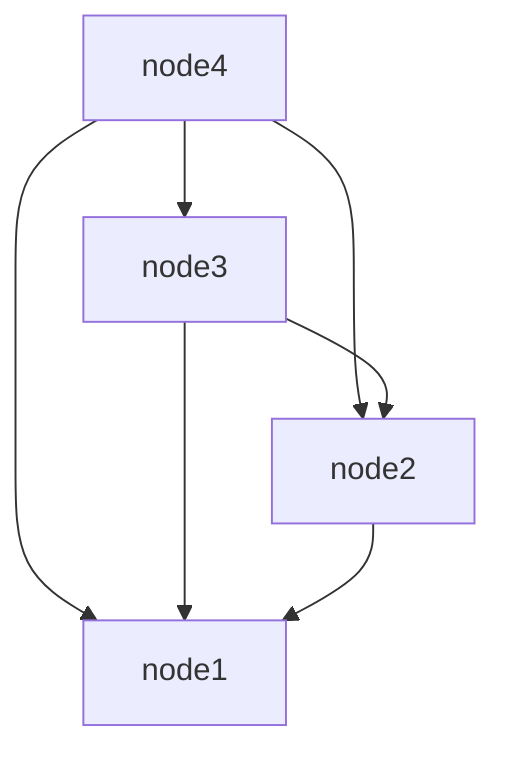

# Libsql Inter-Node Communication protocol: LINC protocol

## Overview

This document describes the version 1 of Libsql Inter-Node Communication (LINC)
protocol.

The first version of the protocol aims to merge the existing two
protocol (proxy and replication) into a single one, and adds support for multi-tenancy.

LINC v1 is designed to handle 3 tasks:
- inter-node communication
- database replication
- proxying of request from replicas to primaries

LINC makes use of streams to multiplex messages between databases on different nodes.

LINC v1 is implemented on top of TCP.

LINC uses bincode for message serialization and deserialization.

## Connection protocol

Each node is identified by a `node_id`, and an address.
At startup, a sqld node is configured with list of peers (`(node_id, node_addr)`). A connection between two peers is initiated by the peer with the greatest node_id.



A new node node can be added to the cluster with no reconfiguration as long as its `node_id` is greater than all other `node_id` in the cluster and it has the address of all the other nodes. In this case, the new node will initiate a connection with all other nodes.

On disconnection, the initiator of the connection attempts to reconnect.

## Messages

```rust
enum Message {
    /// Messages destined to a node
    Node(NodeMessage),
    /// message destined to a stream
    Stream {
        stream_id: StreamId,
        payload: StreamMessage,
    },
}

enum NodeMessage {
    /// Initial message exchanged between nodes when connecting
    Handshake {
        protocol_version: String,
        node_id: String,
    },
    /// Request to open a bi-directional stream between the client and the server
    OpenStream {
        /// Id to give to the newly opened stream
        stream_id: StreamId,
        /// Id of the database to open the stream to.
        database_id: Uuid,
    },
    /// Close a previously opened stream
    CloseStream {
        id: StreamId,
    },
    /// Error type returned while handling a node message
    Error(NodeError),
}

enum NodeError {
    UnknownStream(StreamId),
    HandshakeVersionMismatch { expected: u32 },
    StreamAlreadyExist(StreamId),
    UnknownDatabase(DatabaseId, StreamId),
}

enum StreamMessage {
    /// Replication message between a replica and a primary
    Replication(ReplicationMessage),
    /// Proxy message between a replica and a primary
    Proxy(ProxyMessage),
    Error(StreamError),
}

enum ReplicationMessage {
    HandshakeResponse {
        /// id of the replication log
        log_id: Uuid, 
        /// current frame_no of the primary
        current_frame_no: u64,
    },
    /// Replication request
    Replicate {
        /// next frame no to send
        next_frame_no: u64,
    },
    /// a batch of frames that are part of the same transaction
    Transaction {
        /// if not None, then the last frame is a commit frame, and this is the new size of the database.
        size_after: Option<u32>,
        /// frame_no of the last frame in frames
        end_frame_no: u64
        /// a batch of frames part of the transaction.
        frames: Vec<Frame>
    },
    /// Error occurred handling a replication message
    Error(StreamError)
}

struct Frame {
    /// Page id of that frame
    page_id: u32,
    /// Data
    data: Bytes,
}

enum ProxyMessage {
    /// Proxy a query to a primary
    ProxyRequest {
       /// id of the connection to perform the query against
       /// If the connection doesn't already exist it is created
       /// Id of the request.
       /// Responses to this request must have the same id.
       connection_id: u32,
       req_id: u32,
       query: Query,
    },
    /// Response to a proxied query
    ProxyResponse {
        /// id of the request this message is a response to.
       req_id: u32,
       /// Collection of steps to drive the query builder transducer.
       row_step: [RowStep]
    },
    /// Stop processing request `id`.
    CancelRequest {
       req_id: u32,
    },
    /// Close Connection with passed id.
    CloseConnection {
        connection_id: u32,
    },
}

/// Steps applied to the query builder transducer to build a response to a proxied query.
/// Those types closely mirror those of the `QueryBuilderTrait`.
enum BuilderStep { 
    BeginStep,
    FinishStep(u64, Option<u64>),
    StepError(StepError),
    ColsDesc([Column]),
    BeginRows,
    BeginRow,
    AddRowValue(Value),
    FinishRow,
    FinishRos,
    Finish(ConnectionState)
}

// State of the connection after a query was executed
enum ConnectionState {
    /// The connection is still in a open transaction state
    OpenTxn,
    /// The connection is idle.
    Idle,
}

struct Column {
    /// name of the column
   name: string,
   /// Declared type of the column, if any.
   decl_ty: Option<string>,
}

/// for now, the stringified version of a sqld::error::Error.
struct StepError(String);

enum StreamError { 
    NotAPrimary,
    AlreadyReplicating,
}
```

## Node Handshake

When a node connects to another node, it first need to perform a handshake. The
handshake is initialized by the initializer of the connection. It sends the
following message:

```typescipt
type NodeHandshake = {
    version: string, // protocol version
    node_id: string,
}
```

If a peer receives a connection from a peer with a id smaller than his, it must reject the handshake with a `IllegalConnection` error

## Streams

Messages destined to a particular database are sent as part of a stream. A
stream is created by sending a `NodeMessage::OpenStream`, specifying the id of
the stream to open, along with the id of the database for which to open this
stream. If the requested database is not on the destination node, the
destination node respond with a `NodeError::UnknownDatabase` error, and the stream in not
opened.

If a node receives a message for a stream that was not opened before, it responds a `NodeError::UnknownStream`

A stream is closed by sending a `CloseStream` with the id of the stream. If the
stream does not exist an `NodeError::UnknownStream` error is returned.

Streams can be opened by either peer. Each stream is identified with by `i32`
stream id. The peer that initiated the original connection allocates positive
stream ids, while the acceptor peer allocates negative ids. 0 is not a legal
value for a stream_id. The receiver of a request for a stream with id 0 must
close the connection immediately.

The peer opening a stream is responsible for sending the close message. The
other peer can close the stream at any point, but must not send close message
for that stream. On subsequent message to that stream, it will respond with an
`UnknownStream` message, forcing the initiator to deal with recreating a
stream if necessary.

## Sub-protocols

### Replication

The replica is responsible for initiating the replication protocol. This is
done by opening a stream to a primary. If the destination of the stream is not a
primary database, it responds with a `StreamError::NotAPrimary` error and immediately close
the stream. If the destination database is a primary, it responds to the stream
open request with a `ReplicationMessage::HandshakeResponse` message. This message informs the
replica of the current log version, and of the primary current replication
index (frame_no).

The replica compares the log version it received from the primary with the one it has, if any. If the
versions don't match, the replica deletes its state and start replicating again from the start.

After a successful handshake, the replica sends a `ReplicationMessage::Replicate` message with the
next frame_no it's expecting. For example if the replica has not replicated any
frame yet, it sends `ReplicationMessage::Replicate { next_frame_no: 0 }` to
signify to the primary that it's expecting to be sent frame 0. The primary
sends the smallest frame with a `frame_no` satisfying `frame_no >=
next_frame_no`. Because logs can be compacted, the next frame_no the primary
sends to the replica isn't necessarily the one the replica is expecting. It's correct to send
the smallest frame >= next_frame_no because frame_nos only move forward in the event of a compaction: a
frame can only be missing if it was written too more recently, hence _moving
forward_ in the log. The primary ensure consistency by moving commit points
accordingly. It is an error for the primary to send a frame_no strictly less
than the requested frame_no, frame_nos can be received in any order.

In the event of a disconnection, it is the replica's duty to re-initiate the replication protocol.

Sending a replicate request twice on the same stream is an error. If a primary
receives more than a single `Replicate` request, it closes the stream and sends
a `StreamError::AlreadyReplicating` request. The replica can re-open a stream and start
replicating again if necessary.

### Proxy

Replicas can proxy queries to their primary. Replica can start sending proxy request after they have sent a replication request.

To proxy a query, a replica sends a `ProxyRequest`. Proxied query on a same connection are serialized. The replica sets the connection id
and the request id for the proxied query. If no connection exists for the
passed id on the primary, one is created. The query is executed on the primary,
and the result rows are returned in `ProxyResponse`. The result rows can be split
into multiple `ProxyResponse`, enabling row streaming. A replica can send a `CancelRequest` to interrupt a request. Any
`ProxyResponse` for that `request_id` can be dropped by the replica, and the
primary should stop sending any more `ProxyResponse` message upon receiving the
cancel request. The primary must rollback a cancelled request.

The primary can reduce the amount of concurrent open transaction by closing the
underlying SQLite connection for proxied connections that are not in a open
transaction state (`is_autocommit` is true). Subsequent requests on that
connection id will re-open a connection, if necessary. 
